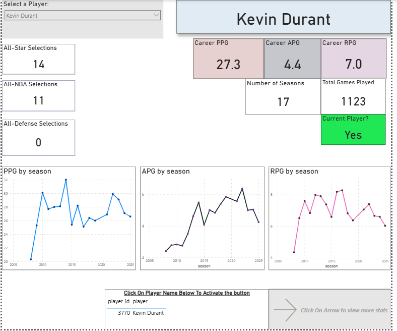

# NBA Player Analytics Power BI Dashboard

This project is an interactive Power BI dashboard that visualizes the complete statistical history of all **5,313 NBA players**. The data was sourced from five CSV files from Kaggle and combined into a single analytics model after an **ETL** process in **Python**.

## Features
- **Searchable player filter**: View career averages for PPG, APG, RPG as KPI cards.
- **Season-by-season trends**: Line charts for points, assists, and rebounds over time.
- **Top 10 player rankings**: Career & total points, assists, rebounds using stacked bar + line charts.
- **Interactive navigation**: Buttons to switch between dashboard pages.

## Tools
- Power BI (Data Visualization, DAX, Power Query)
- Python (Data Cleaning, Pandas)
- Excel / CSV Files
- Data Storytelling via interactive visuals

## Data Preparation/ Data Cleaning
The dataset consisted of 5 separate CSV files that could be joined using either player_id or player_name. Before importing into Power BI, I performed a data cleaning and transformation process in Python.

### Cleaning Player Names
Some player names contained non-ASCII characters or encoding issues. To identify them:
```
# Check rows with non-ASCII characters
mask = all_nba['player'].apply(lambda x: any(ord(char) > 127 for char in x))
weird_values = all_nba[mask]

print(weird_values['player'])
```
Then I replaced incorrect names with their proper forms:
```
fixes = {
    "Dražen Petrovi?": "Dražen Petrović",
    "Toni Kukoč": "Toni Kukoč",
    "Peja Stojaković": "Peja Stojaković",
    "Hedo TürkoÄŸlu": "Hedo Türkoğlu",
    "Vladimir Radmanović": "Vladimir Radmanović",
    "Željko Rebra?a": "Željko Rebrača",
    "Manu Ginóbili": "Manu Ginóbili",
    "Nenê": "Nenê",
    "Nenad Krstić": "Nenad Krstić",
    "Goran Dragi?": "Goran Dragić",
    "Rudy Fernández": "Rudy Fernández",
    "Jonas ValančiÅ«nas": "Jonas Valančiūnas",
    "Bojan Bogdanovi?": "Bojan Bogdanović",
    "Jusuf Nurkić": "Jusuf Nurkić",
    "Nikola Mirotić": "Nikola Mirotić",
    "Kristaps Porziņģis": "Kristaps Porziņģis",
    "Nikola Jokić": "Nikola Jokić",
    "Dario Å arić": "Dario Šarić",
    "Willy Hernangómez": "Willy Hernangómez",
    "Bogdan Bogdanovi?": "Bogdan Bogdanović",
    "Luka Dončić": "Luka Dončić"
}

all_nba['player'] = all_nba['player'].replace(fixes)
```
This step was repeated for all CSV files containing player names.

### Validating Player IDs Across Tables
To maintain data integrity, I verified that each player_id consistently matched the correct player name across all datasets.

#### Step 1 – Identify mismatches between df1 and player_awards:
```
compare1 = pd.merge(
    df1[['player_id', 'player']], 
    player_awards[['player_id', 'player']], 
    on='player_id', 
    suffixes=('_df1', '_awards')
)
compare1[compare1['player_df1'] != compare1['player_awards']].drop_duplicates()

```
This check revealed cases where the same player_id was assigned to different names (e.g., player_id = 4859 was "Lamar Stevens" in df1 but "LaMelo Ball" in player_awards).

#### Step 2 – Compare and Fix player_id Values
I repeated this comparison for 2 other datasets against df1 to make sure every player_id matched the correct player name. The all_star.csv file did not contain a player_id column so it was joined on the player name column.

**- Step 2.1 – Get unique player_id values from player_awards:**
```
ids = player_awards['player_id'].unique()
```
**- Step 2.2 – Loop through IDs and compare player names:**
```
for val in ids:
    name_awards = player_awards[player_awards['player_id'] == val]['player'].iloc[0]
    name_df1 = df1[df1['player_id'] == val]['player'].iloc[0]
```
This returns the player name from the player_awards dataframe and the df1 dataframe where the player_id = val

**- Step 2.3 – If names exist, get the correct player_id from df1 and compare:**
If name_awards is not null, retrieve its corresponding player_id from the df1 dataframe and store it in df1_id. Then compare val with df1_id to check for mismatches.
```
if name_awards:
    df1_id = df1[df1['player'] == name_awards]['player_id'].iloc[0]
    if df1_id:
        if val != df1_id:
```
**- Step 2.4 – Update mismatched IDs**
The final step checks if val is different from df1_id. If so, update the player_awards dataframe with the correct player_id from df1 to ensure consistency between datasets.
```
player_awards.loc[player_awards['player'] == name_awards, 'player_id'] = df1_id
```

**Complete code for matching and correcting player IDs:**
```
ids = player_awards['player_id'].unique()
for val in ids:
    name_awards = player_awards[player_awards['player_id'] == val]['player'].iloc[0]
    name_df1 = df1[df1['player_id'] == val]['player'].iloc[0]

    if name_awards:
        df1_id = df1[df1['player'] == name_awards]['player_id'].iloc[0]

        if df1_id:
            
            if val != df1_id:
                print(val)
                print("player_awards:", name_awards)
                print("df1         :", name_df1)
                print("Matching df1 player_id(s) for", name_awards, ":", df1_id)
                print()
                player_awards.loc[player_awards['player'] == name_awards, 'player_id'] = df1_id
```
## Exporting cleaned data for Power BI
Once data cleaning was performed, the resulting dataframes were converted to a csv file so they can be exported into Power BI using the following code:

```
df1.to_csv("C:/Users/omair/Downloads/nbaPowerBi/player_stats.csv")
df2.to_csv("C:/Users/omair/Downloads/nbaPowerBi/players_info.csv")
all_nba.to_csv("C:/Users/omair/Downloads/nbaPowerBi/all_nba.csv")
player_awards.to_csv("C:/Users/omair/Downloads/nbaPowerBi/player_awards.csv")
all_star.to_csv("C:/Users/omair/Downloads/nbaPowerBi/all_star.csv")
```

## Dashboard
After importing the CSV files into Power BI, I built an interactive NBA player dashboard. The home page features cards displaying a player’s career averages for points per game (PPG), assists per game (APG), and rebounds per game (RPG), along with a line chart showing season-by-season trends. A search filter allows users to quickly select a player, while additional cards display details such as whether the player is active and their number of All-Star selections. At the bottom, a navigation arrow lets users access more in-depth player information on additional pages.



Clicking the arrow at the bottom of the page navigates the user to another sheet displaying additional player information, including the number of All-NBA 1st, 2nd, and 3rd Team selections, All-Defense 1st and 2nd Team honors, and a table summarizing all awards the player has won.


The additional page features three line and stacked column charts highlighting the top 10 players in NBA history for points, assists, and rebounds. In each chart, the bars represent total career statistics, while the lines indicate career average trends for each player.


